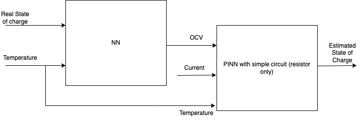

# soc-estimation
Soc Estimation batteries with LG dataset

## Design of the network

The first network is responsible for estimating the open circuit voltage based on the SoC. This is done removing all data except the one with the `PAU` Status. Then the network is taken and "inserted" into the PINN to use it to compute the Physical loss. In fact, for the physical loss, considering the simple equivalent circuit of a battery with a resistor, the physical law is the Kirchhoff's law. 

By doing this it's really easy to incorporate the physical loss into the neural network. 